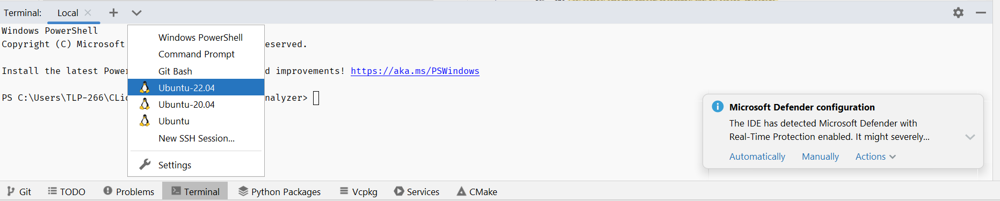
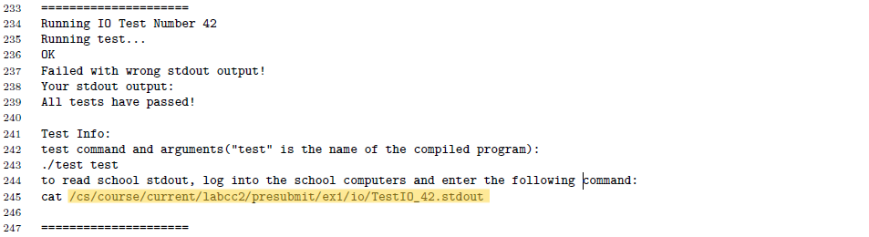
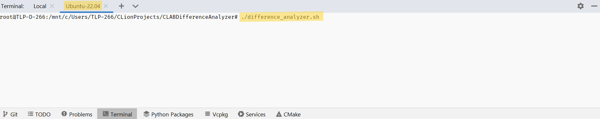

## CLAB Difference Analyzer

#### Use this amazing tool to find your mistakes on C/C++ projects, and fix them easily!

### How to use
1) Download `difference_analyzer.sh` into your project's directory.
   * You can also run:
   * `$ wget https://github.com/yoavstrugo/CLABDifferenceAnalyzer/releases/latest/download/difference_analyzer.sh`
   * in your project's directory (inside your linux terminal).

2) Enter the <b>linux machine</b> terminal (in CLion click the arrow above 
   the terminal, and select `Ubuntu...`).

3) Find the output file specified in the submission pdf you received after 
   submitting the project.

4) Get you cse username and password

5) Make sure to compile your project.

6) On the linux terminal, run `$./difference_analyzer.sh` and follow the 
   on-screen instructions.

7) At the end, if you have any mistake, you will see your output on the left 
   and the correct output on the right.

### Use it Faster! ⚡
If you'd like to skip entering the CSE username and password each time, you 
can add the environment variables `CSE_USERNAME` and `CSE_PASSWORD` to your 
shell, and the program will automatically read them!
To do that:
1) Run `$ nano ~./bashrc`
2) Scroll to the bottom
3) Add the lines:
   * `CSE_USERNAME=<cse_username>`
   * `CSE_PASSWORD=<cse_password>`
   * replace the `<..>` with what it describes. <b>Don't add space between 
     the equal sign and the words</b>
4) Hit `Ctrl-S` and then `Ctrl-X`
5) Restart CLion, now you should be able to run the program, any time, 
   without entering your CSE credentials again!